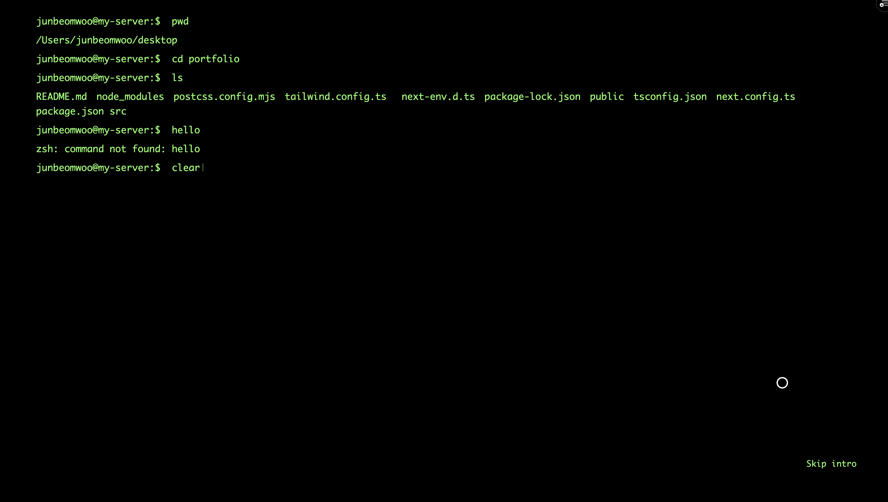

# Junbeom Woo - Fullstack Developer



• [Visit the website here](https://junbeomwoo.vercel.app/en)

<br /> <br />
## Introduction
I have created a personal portfolio website with responsibe features for mobile, tablet and computer.

You can find there information about me including short introduction, my skills, academic credentials, and contact information.

It supports English and Danish, with both dark and light themes for an optimized user experience. 

Moreover, in the portfolio section, you can find various projects I created as personal projects.

<br /> <br />
## Development Environment
• Client : HTML, Next.js, Tailwind CSS

• Deployment environment : Vercel

• Design : Adobe Illustrator, Adobe Photoshop

<br /> <br />
## Project structure  

```
.
├── README.md
├── messages
│   ├── da.json
│   └── en.json
├── next-env.d.ts
├── next.config.mjs
├── package-lock.json
├── package.json
├── postcss.config.mjs
├── public
│   ├── junbeomwoo.jpg
│   ├── logo.png
│   ├── nmp.png
│   ├── resume.pdf
│   │       .
│   │       .
│   └──     .
├── src
│   ├── app
│   │   ├── [locale]
│   │   │   ├── about
│   │   │   │   ├── error.tsx
│   │   │   │   ├── loading.tsx
│   │   │   │   └── page.tsx
│   │   │   ├── clientLayout.tsx
│   │   │   ├── contact
│   │   │   │   ├── error.tsx
│   │   │   │   ├── loading.tsx
│   │   │   │   └── page.tsx
│   │   │   ├── error.tsx
│   │   │   ├── layout.tsx
│   │   │   ├── loading.tsx
│   │   │   ├── page.tsx
│   │   │   └── project
│   │   │       ├── error.tsx
│   │   │       ├── loading.tsx
│   │   │       └── page.tsx
│   │   ├── api
│   │   │   └── send-mail
│   │   │       └── route.tsx
│   │   ├── components
│   │   │   ├── Computers.js
│   │   │   ├── SpinningBox.js
│   │   │   ├── about.tsx
│   │   │   ├── background.js
│   │   │   ├── contact.tsx
│   │   │   ├── customCursor.tsx
│   │   │   ├── header.tsx
│   │   │   ├── loading.tsx
│   │   │   ├── main.tsx
│   │   │   ├── mainContent.tsx
│   │   │   ├── project.tsx
│   │   │   └── secondBackground.tsx
│   │   ├── context
│   │   │   ├── CursorContext.tsx
│   │   │   └── theme-provider.tsx
│   │   ├── fonts
│   │   │   ├── AppleSDGothicNeo.ttc
│   │   │   ├── Cascadia.ttf
│   │   │   ├── GeistMonoVF.woff
│   │   │   ├── GeistVF.woff
│   │   │   └── Monaco.ttf
│   │   └── styles
│   │       └── globals.css
│   ├── i18n
│   │   ├── request.ts
│   │   └── routing.ts
│   ├── middleware.ts
│   └── types
│       ├── globale.d.ts
│       └── react-shuffle-text.d.ts
├── tailwind.config.ts
└── tsconfig.json
```

## License Information

### MIT License
This site is built using open-source software licensed under the 
[MIT License](https://opensource.org/licenses/MIT).  
Copyright (c) 2020 Paul Henschel. Modified by Junbeom Woo.
